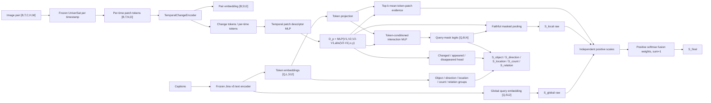

# QCPR v2 architecture and training contract

## Scope

QCPR v2 is the fine-grained retrieval and grounding head for UniChange v2. It keeps semantic retrieval as the primary objective while adding query-conditioned localization and structured object, direction, location, count, and replacement evidence. QCPR v1 remains an unchanged compatibility baseline.

## Architecture



The patch descriptor preserves signed temporal direction and spatial position. Local evidence is not a single maximum: it uses faithful sigmoid-mask pooling plus top-k mean token-patch evidence. The final score is:

```text
z_k = exp(log_scale_k) * S_k
w = softmax(fusion_logits)
S_final = w_global*z_global + w_local*z_local + w_token*z_token_patch
```

Per-branch additive constants are fixed zero buffers. Under normalized fusion they collapse into one candidate-independent offset, which ranking losses cannot identify.

## Training supervision

- Semantic set retrieval remains primary; exact pair identity is diagnostic.
- Direct local margin loss separates real positives from structured hard negatives.
- Structured negatives cover wrong direction, wrong location, wrong count, wrong object, and no-change lookalikes.
- Structured FNA and semantic-teacher relevance exclude likely latent positives from negative mining.
- Conditional instance loss is applied only inside a broad semantic-positive group.
- Query mask losses use query-specific or generic supervision with explicit target kinds.
- Temporal channel losses supervise changed, appeared, disappeared, and reversal consistency.
- Attribute auxiliary losses are applied only when labels exist and are averaged over active attributes, preventing richly annotated batches from receiving up to five times the gradient scale.

## Dataset contracts

| Split | Required datasets | Purpose |
|---|---|---|
| Train | LEVIR-MCI, SECOND-CC, S2Looking | retrieval + semantic/generic/query-specific localization |
| Retrieval validation | LEVIR-MCI, SECOND-CC | semantic and structured retrieval |
| Localization validation | S2Looking | appeared/disappeared/query-specific masks |

S2Looking must not be inserted into retrieval validation.

## Full-training readiness settings

The 500-step pilot established the following evidence:

- batch 32 OOMed during full optimizer-backed training;
- batch 24 completed 500 steps on one H100;
- QCPR v2 validation must use query/candidate chunking (16/32); the v1-safe 64/256 setting materializes much larger token-conditioned interaction tensors and OOMs;
- the old auxiliary sum over attributes was over-scaled;
- gradient norm before clipping had median 7.70 and p90 10.91, so clip=1 activated on every pilot step.

The prepared deterministic full-training path therefore uses:

```text
batch_size = 24
bf16 = true
query_chunk_size = 16
candidate_chunk_size = 32
grad_clip_norm = 5.0 for new training (1.0 only when faithfully finalizing the old pilot)
structured auxiliary reduction = mean over active attributes
initialization = immutable QCPR v1 checkpoint
```

Before a long run, repeat a short post-change pilot and require a materially lower clipping fraction, finite nonzero gradients, and no semantic-retrieval regression. Do not launch a full run until the matched v1/v2 acceptance comparison is complete.

## Evaluation and visual artifacts

Retrieval and localization must be evaluated separately. Each evaluation writes branch metrics, calibration, hard-negative and latent-positive audits, and a `visuals/` directory containing query panels and ranked candidates. QCPR v1 temporal channels are rendered as unavailable; trained QCPR v2 checkpoints render changed, appeared, and disappeared maps with provenance.
