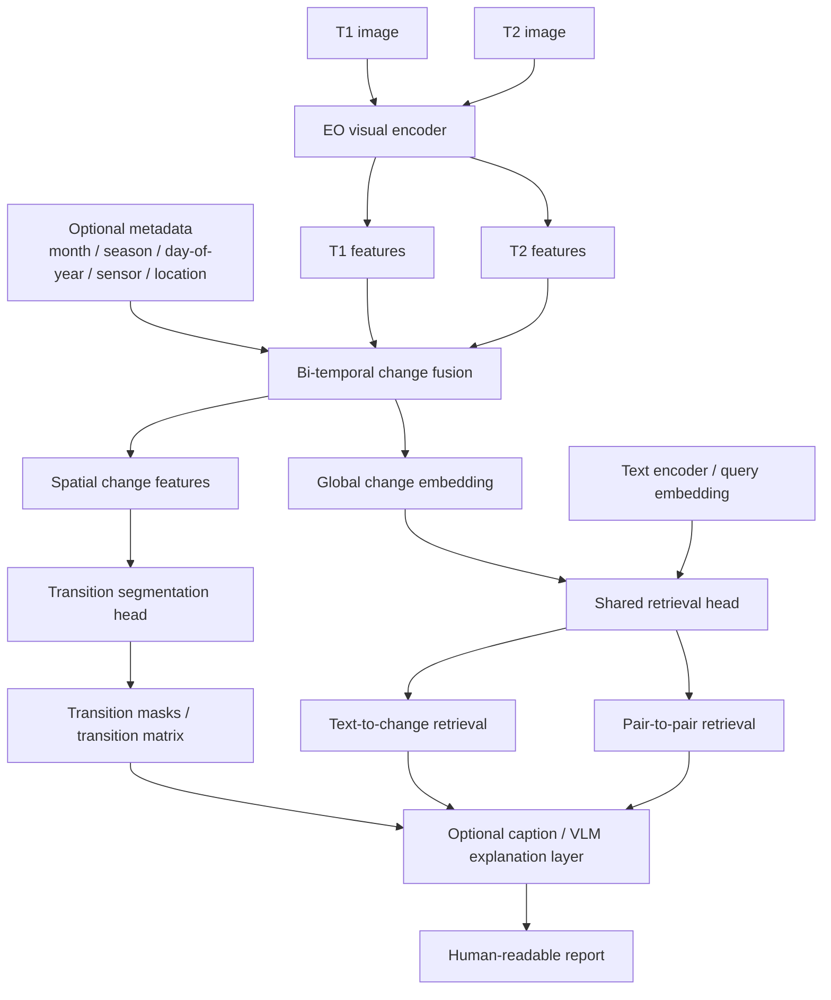

# Retraining Strategy

Date: 2026-06-05

## Core Position

The first practical training path should not center a general-purpose VLM.

The project should start from a remote-sensing evidence model:

`EO visual backbone -> bi-temporal change fusion -> transition segmentation + retrieval -> optional explanation`

This keeps the project aligned with the canonical semantic-first goal:

`T1 semantic segmentation -> T2 semantic segmentation -> transition matrix -> interpretable report`

## Why Not Start With Qwen Or Another VLM

A VLM can be useful later for explanation, captioning, or instruction following, but it is a risky choice for the first ground-truth-producing model:

- spatial mask quality is harder to control than with a dedicated EO segmentation stack
- language fluency can hide weak pixel evidence
- end-to-end VLM training expands scope too early across segmentation, retrieval, captioning, and instruction tuning

So the correct split is:

- evidence model first
- language model last

## Model Roles

- `mfaytin/mask2former-satellite`: current RGB-only prototype and fallback
- `Prithvi-EO-2.0-300M-TL`: preferred first EO backbone for practical TerraTorch iteration
- `Prithvi-EO-2.0-600M-TL`: heavier benchmark follow-up after the 300M path is stable
- `RemoteCLIP` or similar text encoder: retrieval alignment candidate
- `CDMamba`: binary changed/unchanged baseline only, not the semantic transition backbone
- Qwen / Gemma / EarthDial class VLMs: optional explanation layer after deterministic evidence exists

## System Diagram

## MVP Training Order

### Stage 1: Visual Change Representation

Train or fine-tune a bi-temporal EO model that learns spatial evidence before any language generation is added.

Inputs:

- T1 image
- T2 image

Outputs:

- auxiliary binary change mask
- semantic transition evidence

Recommended backbone direction:

- start with `Prithvi-EO-2.0-300M-TL` when the TerraTorch path is ready
- keep `mask2former-satellite` available as the RGB fallback baseline

### Stage 2: Closed-Set Transition Segmentation

Add a measurable transition head:

`F_change -> decoder -> [B, K, H, W]`

Start with fixed transition classes such as:

- `no_change`
- `vegetation -> built_up`
- `vegetation -> bare_soil`
- `water -> dry_land`
- `bare_soil -> vegetation`
- `forest -> road`

This is the first stable paper-quality baseline because it is easy to evaluate with IoU, F1, and transition accuracy.

### Stage 3: Text-Change Retrieval

Train a shared embedding space:

- image pair -> `Z_change`
- text query -> `E_text`

Use one retrieval head for both:

- text-to-change retrieval
- pair-to-pair retrieval

No separate pair-to-pair head is required if both tasks share the same change embedding space.

### Stage 4: Prompt-Conditioned Segmentation

After the closed-set baseline is stable, add a text-conditioned mask decoder:

- input: `T1`, `T2`, text prompt
- output: mask for the described change

This is the right point to explore concept-level or open-vocabulary change segmentation.

### Stage 5: Explanation Layer

Only after deterministic evidence works, add a small caption decoder or VLM explanation layer.

The explanation model should consume:

- predicted transition masks
- transition classes
- confidence and uncertainty notes
- retrieved similar examples
- metadata

The explanation model should not be the primary detector.

### Stage 6: Metadata And Seasonal Robustness

Add embeddings for:

- month
- season
- day-of-year
- sensor
- location

This helps reduce false changes caused by seasonality, snow, vegetation cycles, and sensor mismatch.

## What To Exclude From MVP

The first implementation should not include:

- full end-to-end VLM fine-tuning
- V-JEPA or VL-JEPA pretraining
- diffusion or forecasting branches
- Text4Seg-style generative mask output
- hour-of-day embeddings
- open-vocabulary segmentation from day one
- agentic VLM tool use

These are valid research extensions, but they are not the shortest path to a reliable semantic transition system.

## Why This Order

The project should stabilize measurable evidence first:

1. transition segmentation
2. retrieval grounding
3. explanation

That order prevents the language layer from becoming a substitute for pixel evidence.

## Practical End State

After the current scaffold work, the repository should be ready for either:

- direct model plug-in when a suitable EO checkpoint exists
- targeted fine-tuning when only a backbone exists
- later retrieval and explanation expansion without changing the evidence contract
