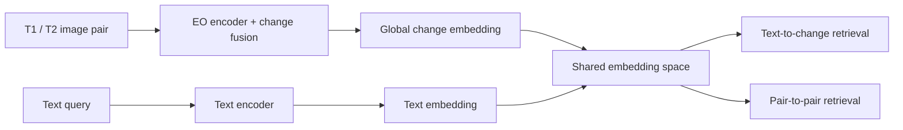

# Retrieval Architecture

## Core Position

Retrieval is a research-layer subsystem, not an extension of the locked demo explanation path.

The architecture is intentionally additive:

- existing `app.py` normal mode remains unchanged
- retrieval lives under `src/land_change_detection/retrieval/`
- research orchestration lives under `src/land_change_detection/pipelines/research_pipeline.py`
- optional UI lives in a separate research page

## Online vs Offline Split

### Offline

- scene discovery
- manifest building
- patch pairing
- embedding generation
- vector index creation
- dataset curation

### Online

- accept query
- choose retrieval mode
- encode query
- search target index
- rerank with metadata
- return structured evidence bundle

## Retrieval Units

- static patch
- bi-temporal pair
- localized change region
- trajectory window

Each retrieval mode should index the correct unit rather than forcing one universal index.

## Evidence Flow

Preferred research flow:

`segmentation evidence -> retrieval evidence -> EvidenceBundle -> optional explainer`

The explainer must consume structured evidence only.

## Retrieval Head Position

The retrieval branch should share the same bi-temporal evidence model as the transition segmentation path.

## Shared Head Rule

One shared retrieval head is preferred for both:

- text-to-change retrieval
- pair-to-pair retrieval

That means the system should not add a separate pair-to-pair head unless experiments show a clear measurable gain.
